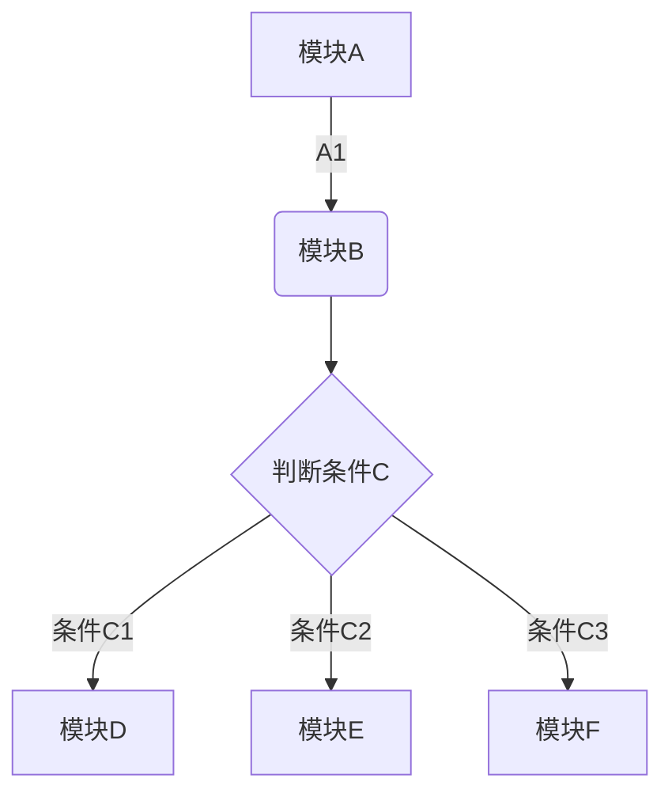
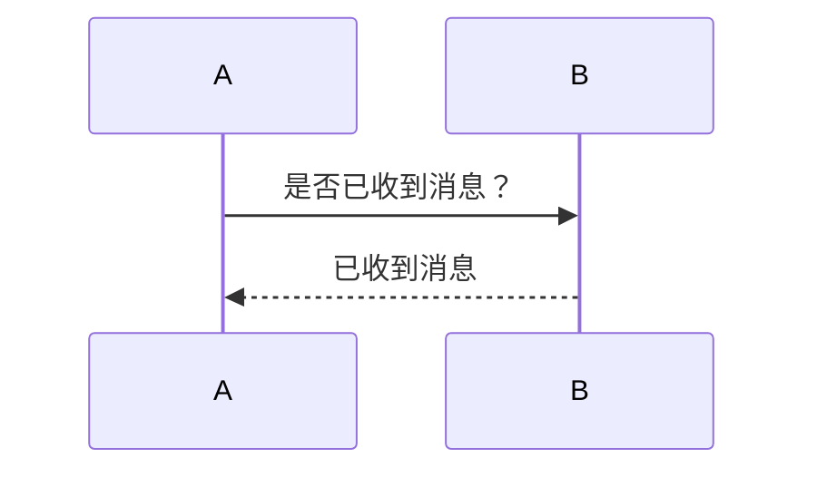
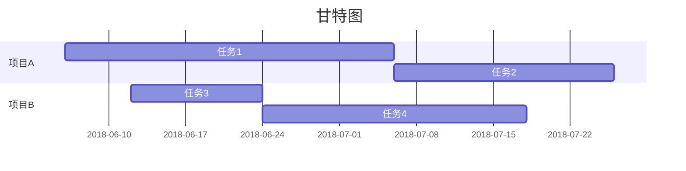

#### 前言

好像每个hexo博客都会有一篇介绍markdown写作技巧，那我也mark一下吧。markdown纯文本相对于传统的富文本来说，只需要在写作时依照规则键入特定的标记，便可实现非常多样的排版效果。无需考虑字体行距等排版元素的干扰，我们可以将更多的精力集中于写作本身，况且markdown排版出来的效果十分简洁易读，在这里我也总结一下，方便自己查阅。

这里说明一下，我通过VS code和印象笔记来使用markdown的。

<!--more-->

#### 基本语法
##### 标题
- \# 一级标题
- \## 二级标题
- \#### 三级标题
- \##### 四级标题
- \###### 五级标题
- \####### 六级标题

##### 加粗
- \*\*我是粗体**
- **我是粗体**

##### 斜体
- \*我是斜体*
- *我是斜体*

##### 下划线
- \<u>我是下滑线<u>
- <u>我是下滑线<u>

##### 删除线
- \~\~我是删除线~~
- ~~我是删除线~~

##### 分隔线
- \--- 或者\***
---

##### 引用
- \>引用内容
- >引用内容

##### 超链接
- \[超链接](http://yulog.me/2019/08/16/markdown%E5%86%99%E4%BD%9C/)
- [超链接](http://yulog.me/2019/08/16/markdown%E5%86%99%E4%BD%9C/)

##### 图片链接
- \!\[图片](https://blog-1258579174.cos.ap-chengdu.myqcloud.com/images/markdown.jpg)
- 

##### 列表
- 无序列表：可以使用\*作为标记，也可以使用\+或者\-作为标记
    - 番茄
    - 马铃薯
    - 圣女果

- 有序列表：使用数字和 `.`作为标记
    1. 番茄
    2. 马铃薯
    3. 圣女果

>此外，无序列表和有序列表之间可以相互嵌套。

##### 文字标亮
- 在英文状态下用\`文字内容`来包围文字即可
- `文字标亮`

##### 代码块
- 用\`\`\`代码块\`\`\`包围代码

```python
number = 56
guess = int(input('输入一个整数：'))
if guess == number:
    print('恭喜你，答对了')
elif guess < number:
    print('不对哦，这个数比你猜的数更大')
else:
    print('不对哦，这个数比你猜的数更小')

print('完毕')
```

##### 表格
单元格和表头：
    表头 | 表头 
    \-\-\-\- | ----
    内容1 | 内容2
    内容3 | 内容4

    表头 | 表头 
    ---- | ----
    内容1 | 内容2
    内容3 | 内容4

对齐：
- \:--- 代表左对齐
- \:--: 代表居中对齐
- \---: 代表右对齐
- \----：默认左对齐

##### 任务清单
通过\[x] 和\[ ]来生成任务清单
- [x] 马铃薯
- [ ] 番茄
- [ ] 圣女果


#### 高级语法
##### 目录
设置之后可以自动根据设置的分级标题来自动生成目录
通过\[TOC]标记来自动生成目录

##### TeX公式
在markdown中LaTex公式分为行内公式和行间公式两种
- 行内公式：用一个美元符号$将公式括起来，\$...$
- 行间公式：用两个美元符号￥将公式括起来，\$\$...$$

函数 ${f(x)=a_nx^n+a_{n-1}x^{n-1}+a_{n-2}x^{n-2}}+\cdots$
函数 $${f(x)=a_nx^n+a_{n-1}x^{n-1}+a_{n-2}x^{n-2}}+\cdots \tag{1.1}$$


##### 流程图


##### 时序表


##### 甘特图


#### 其他平台特有语法
#### 相关链接


